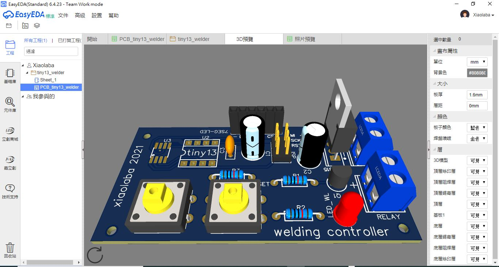

# Tiny13_spot_welder_controller
Controller for Microwave Oven Transformer modified spot welder  
path DIY\2020-12-06_Rasonic_spot_welder\tiny_spot_welder_no_test_yet  

### code design:  
1. init IO, output low, input pull-up  
2. read set point for dwell time, check if user pressed welding button to power the welding transformer, dwell time pass, off power, looping in await state.  

```
int main (void)
{
    uint8_t adc_in=0;
    io_setup();
    adc_setup();
    while (1) {
        adc_in = adc_read();
        read_btn();     
    }
}
```


if alter code design, do it with [tiny_spot_welder.ino](tiny_spot_welder.ino), cp_main.bat only copy this to main.c for command line compiler  


note:  
compile with ARduino IDE, delete main.c first  

compile with avr-gcc under Windows OS, both build.bat and dosmake.bat should be doing the same  

output folder \firmware   


wedling & testing, done
https://youtu.be/22l9OKWL98g  


hardware or reference design,
[different design](https://xiaolaba.wordpress.com/2020/10/23/polish-%e5%a4%a7%e9%99%b8%e7%b2%be%e8%89%af%e5%92%8c%e7%a7%91%e6%8a%80-%e5%be%ae%e9%9b%bb%e8%85%a6%e9%ab%98%e9%a0%bb%e7%b2%be%e5%af%86%e7%84%8a%e6%8e%a5%e6%a9%9f-%e9%9a%a8%e6%a9%9f%e8%b7%b3%e9%9b%bb/)  

[555 timer design reference](http://www.kerrywong.com/2017/06/18/dual-purpose-spot-welder-with-pulse-duration-control/)  


## schematic, actual product, removed all LED & code, no need  
  


## relay and specification, JD2-1A, Galanz OEM and compatible  
https://fccid.io/UHW10025001/Parts-List/Tune-Up-Info/Part-List-1066694  
https://fccid.io/UHW10025001/Parts-List/Tune-Up-Info/Part-List-1066694.pdf  

submitted in 2009  


Tyco Electronics EC K.K.  
OMIF-S-112LM (E82292)   

Xiamen Hongfa  
JQX-62F-012-1H(E133481)  

Zhejiang Dongya  
JQX-14FY 12V-1H  (E145623)  

GALANZ  
JD2-1A (E246828)                                           
                     


### prototype build  
almost identical to breadboarding  
  


### pcb design  
  

  


### dwell time and calibration done  
https://youtu.be/tW62K7dMc4o  
